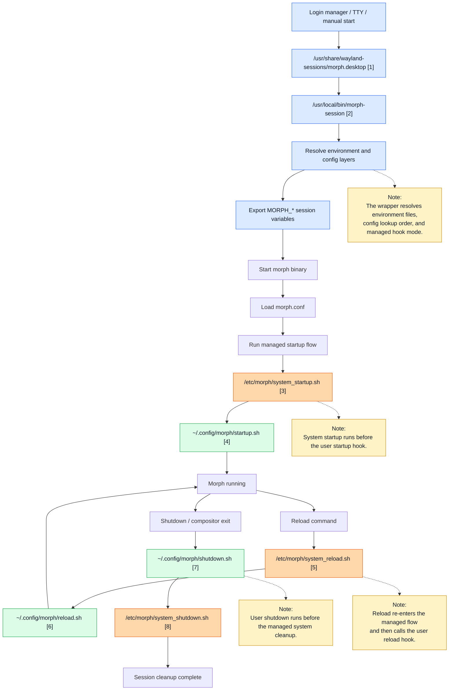
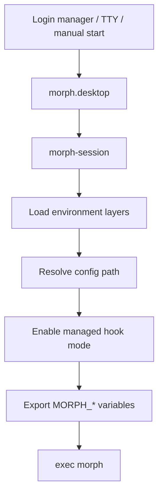
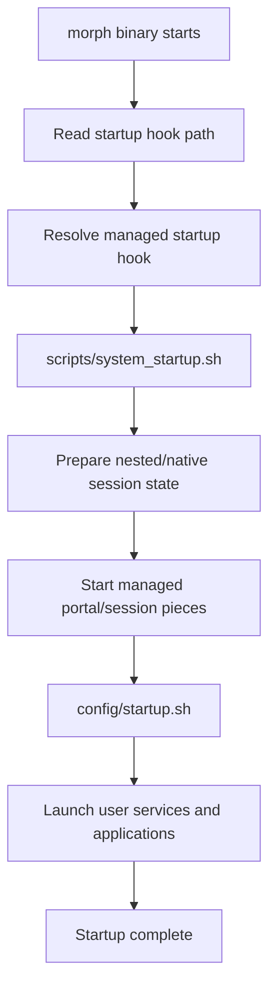
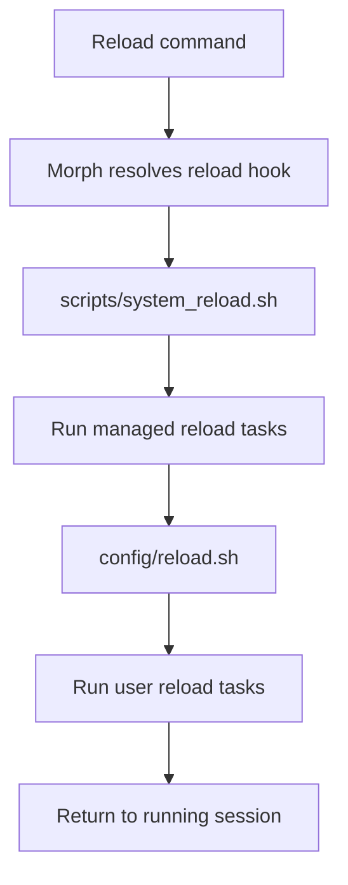
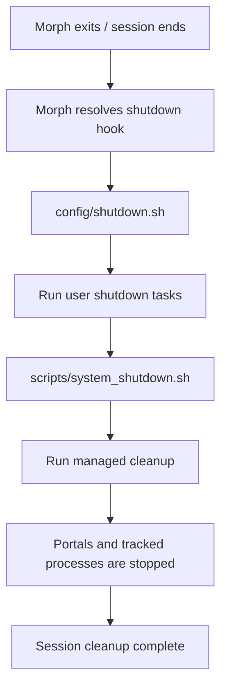
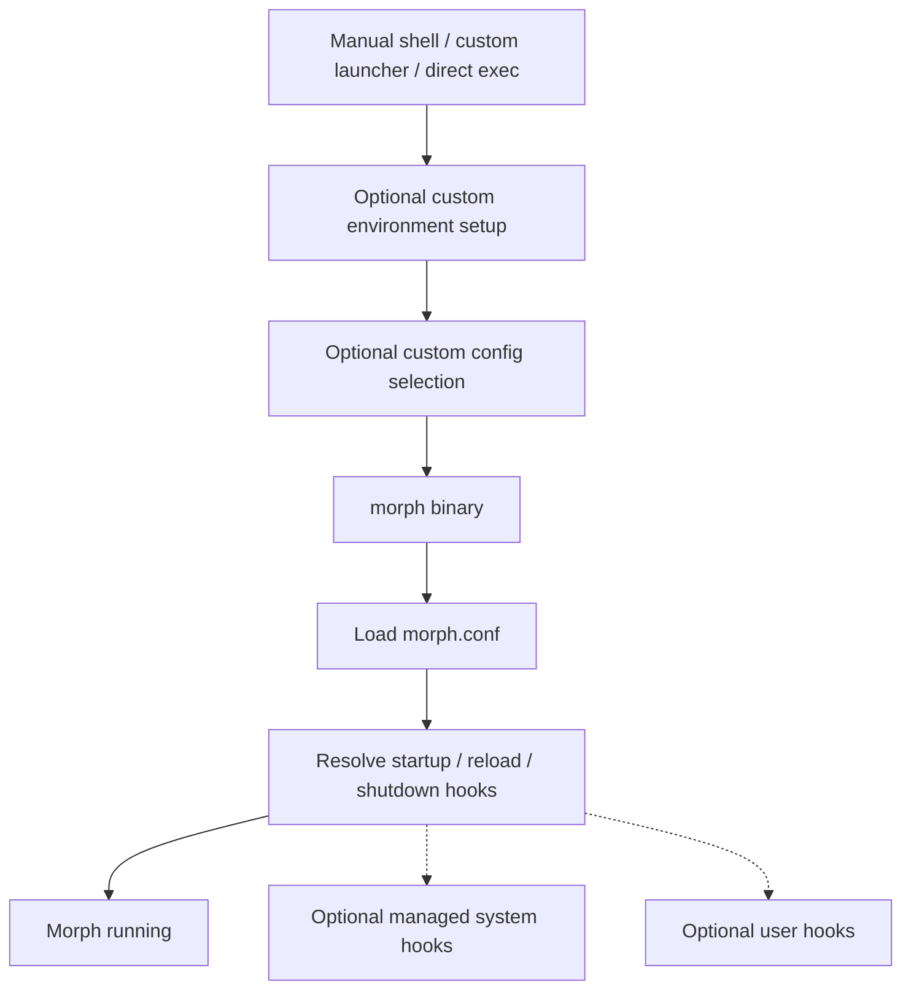
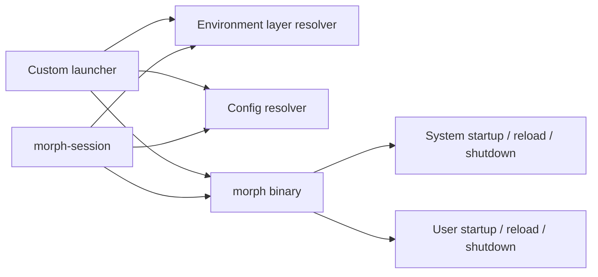

# Morph Overview

This document is the main entry point for **Morph**'s documentation. Use it to understand how the repository is organized, which document answers which question, and how the managed session lifecycle is assembled.

## Table of Contents

- [Reading Guide](#reading-guide)
- [Repository Structure](#repository-structure)
- [Managed Session Overview](#managed-session-overview)
- [Wrapper Flow](#wrapper-flow)
- [Startup Flow](#startup-flow)
- [Reload Flow](#reload-flow)
- [Shutdown Flow](#shutdown-flow)
- [Standalone Binary Flow](#standalone-binary-flow)
- [Building Blocks](#building-blocks)
- [Typical Usage Modes](#typical-usage-modes)
- [Related Documents](#related-documents)

## Reading Guide

If you are new to the project, use this order:

1. Read [`README.md`](../README.md) for the short project overview and top-level entry points.
2. Read this file for the repository map and the high-level runtime flows.
3. Continue with the detail document that matches your current goal.

Choose the next document by question:

| Question | Start Here |
|---|---|
| How does a managed **Morph** session start and stop? | [`docs/LAUNCHER.md`](LAUNCHER.md) |
| Which environment variables affect runtime behavior? | [`docs/ENVIRONMENT.md`](ENVIRONMENT.md) |
| How does [`morph.conf`](../config/morph.conf) work? | [`docs/CONFIG.md`](CONFIG.md) |
| How do I build and test changes? | [`docs/TESTING.md`](TESTING.md) and [`docs/TESTS.md`](TESTS.md) |
| Which command-line flags and runtime control options exist? | [`docs/CLI.md`](CLI.md) |
| Which Wayland protocols are implemented or missing? | [`docs/PROTOCOLS.md`](PROTOCOLS.md) |
| How is the compositor structured internally? | [`docs/COMPOSITOR.md`](COMPOSITOR.md) |
| What is still planned or intentionally unfinished? | [`docs/BACKLOG.md`](BACKLOG.md) |

## Repository Structure

This section is intentionally more detailed than the root [`README.md`](../README.md). The goal is to show where the important moving parts live before the flow diagrams reference them.

# Current Repo Structure

| Path || Description |
|---|---|---|
|└─ [`config/`](../config/) | Runtime defaults and managed session files for **Morph**. ||
|    |└─ [`environment`](../config/environment) | **Morph** runtime environment defaults. Is sourced by [`testing/morph_run`](../testing/morph_run) and [`scripts/morph-session`](../scripts/morph-session). |
|    |└─ [`morph.conf`](../config/morph.conf) | Used working copy of [`docs/morph.conf.example`](morph.conf.example) installed to `/etc/morph/`. Can be overridden by copying it to `~/.config/morph/`. |
|    |└─ [`portals`](../config/portals) | Portal startup script for native sessions installed to `/etc/morph/`. Can be overridden by copying it to `~/.config/morph/`. |
|    |└─ [`reload.sh`](../config/reload.sh) | User reload hook. See [`Reload Resolution`](LAUNCHER.md#reload-resolution) in `docs/LAUNCHER.md`. |
|    |└─ [`shutdown.sh`](../config/shutdown.sh) | User shutdown hook. See [`Shutdown Hook Resolution`](LAUNCHER.md#shutdown-hook-resolution) in `docs/LAUNCHER.md`. |
|    |└─ [`startup.sh`](../config/startup.sh) | User startup hook. See [`Startup Hook Resolution`](LAUNCHER.md#startup-hook-resolution) in `docs/LAUNCHER.md`. |
|└─ [`docs/`](.) | Project and developer documentation. ||
|    |└─ [`OVERVIEW.md`](OVERVIEW.md) | Central reading guide, repository map, and managed session flow entrypoint. |
|    |└─ [`LAUNCHER.md`](LAUNCHER.md) | Shared wrapper behavior for [`morph_run`](../testing/morph_run) and [`morph-session`](../scripts/morph-session). |
|    |└─ [`ENVIRONMENT.md`](ENVIRONMENT.md) | Runtime environment variables, environment-layer behavior, and XKB notes. |
|    |└─ [`CLI.md`](CLI.md) | Binary command-line flags and IPC-aware runtime control behavior. |
|    |└─ [`CONFIG.md`](CONFIG.md) | Overview of **Morph** config format, sections, and behavior. |
|    |└─ [`COMPOSITOR.md`](COMPOSITOR.md) | Compositor architecture, features, and implementation notes. |
|    |└─ [`PROTOCOLS.md`](PROTOCOLS.md) | **Morph** Wayland and portal-related protocol support, gaps, and expectations. |
|    |└─ [`TESTING.md`](TESTING.md) | General workflow, build/test loop, smoke checks, and manual validation entrypoints. |
|    |└─ [`TESTS.md`](TESTS.md) | Automated test scope, test commands, and where to inspect failures. |
|    |└─ [`CRASHING.md`](CRASHING.md) | Crash handling, crash logs, and post-mortem debugging. |
|    |└─ [`DEVFAQ.md`](DEVFAQ.md) | Developer troubleshooting notes, common pitfalls, and workflow hints. |
|    |└─ [`BACKLOG.md`](BACKLOG.md) | Medium- and long-term engineering backlog and follow-up topics. |
|    |└─ [`morph.conf.example`](morph.conf.example) | Example configuration file with comments. |
|    |└─ [`roadmaps/`](roadmaps/) | Branch-specific and topic-specific roadmap documents. |
|    |   └─ [`Roadmap_install-and-user-setup.md`](roadmaps/Roadmap_install-and-user-setup.md) | English roadmap for the install and user setup rework branch. |
|    |   └─ [`Roadmap.de.md`](roadmaps/Roadmap.de.md) | German roadmap notes and follow-up tracking. |
| [`protocols/`](../protocols/) | Wayland protocol XML files for headers and generated sources. ||
| [`scripts/`](../scripts/) | Helpers for startup, reload, shutdown, install, and session management. ||
|    |└─ [`dev-install.sh`](../scripts/dev-install.sh) | Development install script for **Morph** runtime files and helper symlinks. |
|    |└─ [`morph-session`](../scripts/morph-session) | Production **Morph** session wrapper. Resolves environment, config, logs, and session mode for real sessions. |
|    |└─ [`shell-helpers.sh`](../scripts/shell-helpers.sh) | Shared shell helper library used throughout the managed session flow. |
|    |└─ [`system_reload.sh`](../scripts/system_reload.sh) | System reload script for managed config reloads. |
|    |└─ [`system_shutdown.sh`](../scripts/system_shutdown.sh) | System shutdown script for managed config cleanup. |
|    |└─ [`system_startup.sh`](../scripts/system_startup.sh) | System startup script for managed config startup. |
|    |└─ [`system-uninstall.sh`](../scripts/system-uninstall.sh) | Conservative uninstall helper for Meson-installed **Morph** artifacts. |
| [`sessions/`](../sessions/) | Desktop files for production and development sessions. ||
|    |└─ [`morph.desktop`](../sessions/morph.desktop) | Production desktop file for login managers. |
|    |└─ [`morph-dev.desktop`](../sessions/morph-dev.desktop) | Development desktop file for local repo testing through a display manager. |
| [`src/`](../src/) | **Morph** compositor source code. ||
| [`testing/`](../testing/) | Manual tests, launchers, and sample runtime files. See [`docs/TESTING.md`](TESTING.md). ||
|    |└─ [`morph_run`](../testing/morph_run) | **Morph** main development startup script. See [`Wrapper Roles`](LAUNCHER.md#wrapper-roles) in `docs/LAUNCHER.md`. |
|    |└─ [`test-howto_start-variants.nfo`](../testing/test-howto_start-variants.nfo) | Practical native/nested startup variants and focused launcher checks. |
|    |└─ [`testplan-manual-morph.nfo`](../testing/testplan-manual-morph.nfo) | Broader manual lifecycle, install, uninstall, hook, and fallback test plan. |
| [`tests/`](../tests/) | Automation tests for the compositor and shell runtime behavior. See [`docs/TESTS.md`](TESTS.md). ||

## Managed Session Overview

This is the ready-made **Morph** session path used by login managers or by users who want the full managed lifecycle.

Reference legend

| Ref | Details |
|---|---|
| `[1]` | Installed session entry. Source: [`sessions/morph.desktop`](../sessions/morph.desktop) |
| `[2]` | Wrapper script. Source: [`scripts/morph-session`](../scripts/morph-session) |
| `[3]` | Managed startup hook. Source: [`scripts/system_startup.sh`](../scripts/system_startup.sh) |
| `[4]` | User startup hook template. Source: [`config/startup.sh`](../config/startup.sh) |
| `[5]` | Managed reload hook. Source: [`scripts/system_reload.sh`](../scripts/system_reload.sh) |
| `[6]` | User reload hook template. Source: [`config/reload.sh`](../config/reload.sh) |
| `[7]` | User shutdown hook template. Source: [`config/shutdown.sh`](../config/shutdown.sh) |
| `[8]` | Managed shutdown hook. Source: [`scripts/system_shutdown.sh`](../scripts/system_shutdown.sh) |

## Wrapper Flow

The wrapper is the ready-made session entrypoint. It turns a display-manager or shell launch into a predictable **Morph** session with layered environment loading, layered config lookup, and managed hook wiring.

- The wrapper exists to keep session setup reproducible.
- It is the best entrypoint when you want **Morph** to own the full session lifecycle.
- A custom launcher can replace parts of this flow, but then it must deliberately take over those responsibilities.

## Startup Flow

Startup is split into a managed system layer and an optional user layer. This keeps compositor-owned setup reliable while still leaving room for per-user services and applications.

- [`system_startup.sh`](../scripts/system_startup.sh) owns the compositor-side startup preparation.
- [`config/startup.sh`](../config/startup.sh) stays user-facing and is the place for autostart services, panels, bars, terminals, and similar additions.
- In managed mode, the system hook always runs before the user startup hook.

Read the detailed behavior in [`Startup Hook Resolution`](LAUNCHER.md#startup-hook-resolution) in `docs/LAUNCHER.md`.

## Reload Flow

Reload keeps the same layering model as startup: **Morph** first re-enters the managed reload hook, then hands control to the optional user reload hook.

- This flow is useful for restarting bars, launchers, notification daemons, or other session components without tearing down the full session.
- The helper layer can also provide guarded commands such as one-shot reload helpers.

Read the detailed behavior in [`Reload Resolution`](LAUNCHER.md#reload-resolution) in `docs/LAUNCHER.md`.

## Shutdown Flow

Shutdown intentionally inverts the startup order for the user-facing part: the user shutdown hook runs first, and the managed cleanup finishes last.

- [`config/shutdown.sh`](../config/shutdown.sh) is the user-facing place for manual cleanup.
- [`system_shutdown.sh`](../scripts/system_shutdown.sh) owns the managed cleanup and should be the final step so the compositor can clean up the session state it created.

Read the detailed behavior in [`Shutdown Hook Resolution`](LAUNCHER.md#shutdown-hook-resolution) in `docs/LAUNCHER.md`.

## Standalone Binary Flow

**Morph** can also be started without [`morph-session`](../scripts/morph-session). In that case, the binary can still use user hooks, system hooks, or a mixed setup depending on how the config and environment are prepared.

- This is the most flexible mode.
- It is also the mode where the caller must be explicit about which pieces of the managed session stack should still be reused.
- A custom wrapper can selectively replace [`morph-session`](../scripts/morph-session) while still keeping **Morph**'s system hooks.

## Building Blocks

The session architecture is intentionally a small set of reusable parts rather than one indivisible launcher.

- [`morph-session`](../scripts/morph-session) is a ready-made orchestrator, not a hard requirement.
- Environment resolution can stay in shell space where it remains flexible.
- Config parsing belongs to **Morph** because it is the compositor-facing interface.
- System hooks provide the managed lifecycle.
- User hooks remain the extension points for local customization.

## Typical Usage Modes

- Managed session: [`morph.desktop`](../sessions/morph.desktop) -> [`morph-session`](../scripts/morph-session) -> `Morph` -> `System hooks` -> `User hooks`
- Binary with managed hooks: direct **Morph** start, but the resolved hooks still point at the managed system hooks
- Binary with custom user hooks: direct **Morph** start with user-provided hook paths
- Custom wrapper: a user-defined launcher reuses only the building blocks it wants

## Related Documents

- [`docs/LAUNCHER.md`](LAUNCHER.md) for wrapper-owned behavior and runtime file handling
- [`docs/ENVIRONMENT.md`](ENVIRONMENT.md) for runtime environment variables and layering
- [`docs/CLI.md`](CLI.md) for binary command-line flags and IPC-aware control behavior
- [`docs/CONFIG.md`](CONFIG.md) for compositor config syntax, binds, and hook definitions
- [`docs/TESTING.md`](TESTING.md) for build, test, smoke, and manual verification workflows
- [`docs/BACKLOG.md`](BACKLOG.md) for remaining engineering follow-up
