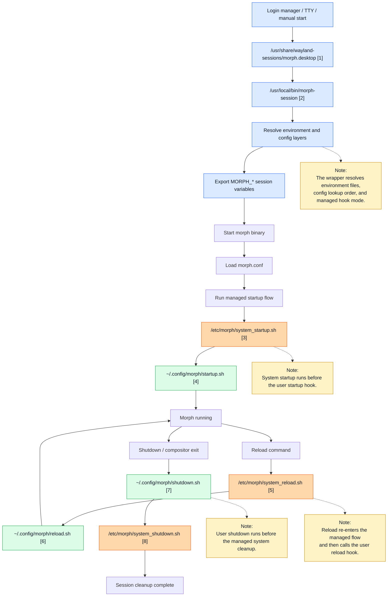
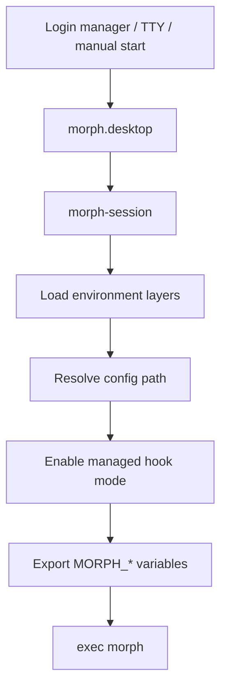
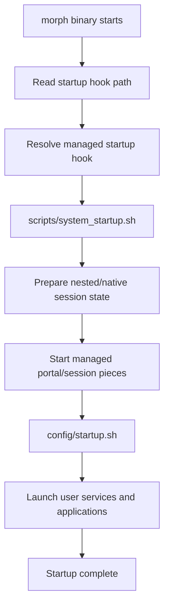
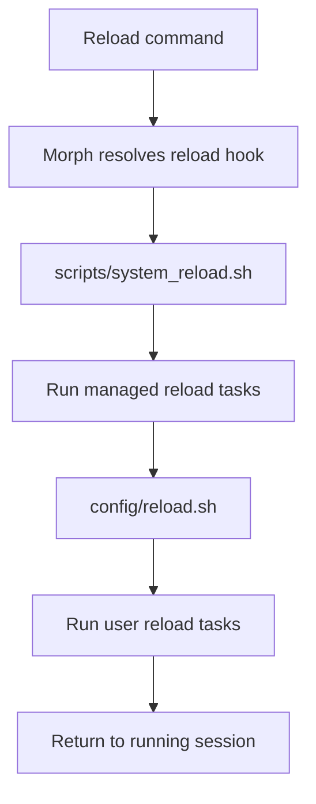
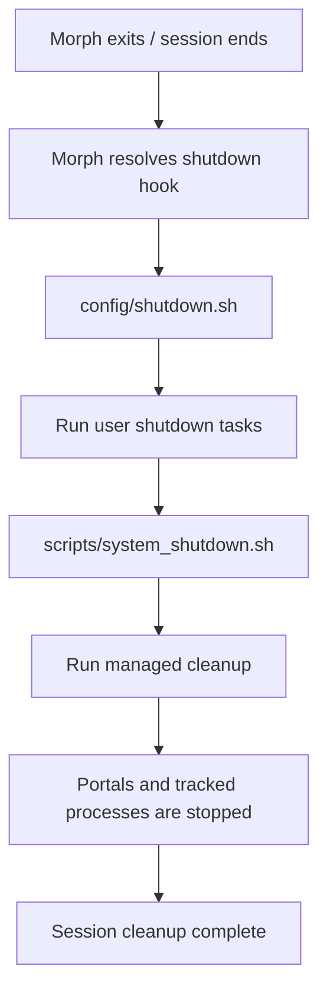
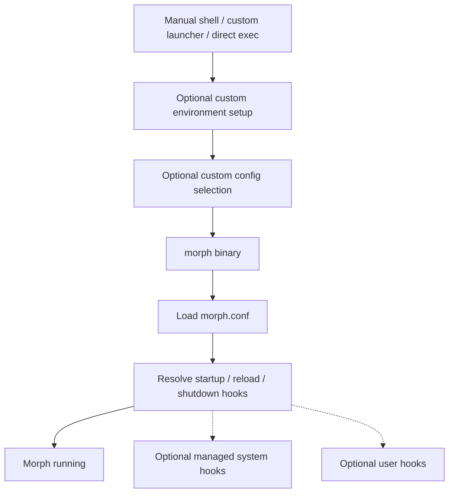
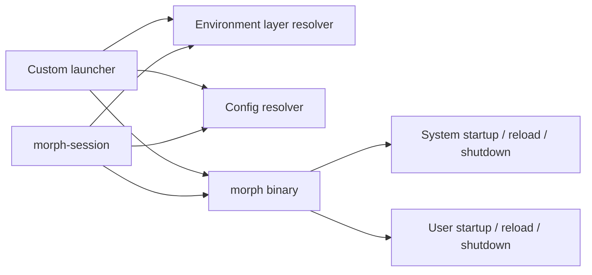

# Morph Overview

This document is the main entry point for Morph's documentation. Use it to understand how the repository is organized, which document answers which question, and how the managed session lifecycle is assembled.

## Table of Contents

- [Reading Guide](#reading-guide)
- [Repository Structure](#repository-structure)
- [Managed Session Overview](#managed-session-overview)
- [Wrapper Flow](#wrapper-flow)
- [Startup Flow](#startup-flow)
- [Reload Flow](#reload-flow)
- [Shutdown Flow](#shutdown-flow)
- [Standalone Binary Flow](#standalone-binary-flow)
- [Building Blocks](#building-blocks)
- [Typical Usage Modes](#typical-usage-modes)
- [Related Documents](#related-documents)

## Reading Guide

If you are new to the project, use this order:

1. Read [`README.md`](../README.md) for the short project overview and top-level entry points.
2. Read this file for the repository map and the high-level runtime flows.
3. Continue with the detail document that matches your current goal.

Choose the next document by question:

| Question | Start Here |
|---|---|
| How does a managed Morph session start and stop? | [`docs/LAUNCHER.md`](LAUNCHER.md) |
| Which environment variables affect runtime behavior? | [`docs/ENVIRONMENT.md`](ENVIRONMENT.md) |
| How does `morph.conf` work? | [`docs/CONFIG.md`](CONFIG.md) |
| How do I build and test changes? | [`docs/TESTING.md`](TESTING.md) and [`docs/TESTS.md`](TESTS.md) |
| Which command-line flags and runtime control options exist? | [`docs/CLI.md`](CLI.md) |
| Which Wayland protocols are implemented or missing? | [`docs/PROTOCOLS.md`](PROTOCOLS.md) |
| How is the compositor structured internally? | [`docs/COMPOSITOR.md`](COMPOSITOR.md) |
| What is still planned or intentionally unfinished? | [`docs/BACKLOG.md`](BACKLOG.md) |

## Repository Structure

This section is intentionally more detailed than the root `README.md`. The goal is to show where the important moving parts live before the flow diagrams reference them.

| Path | Purpose |
|---|---|
| [`config/`](../config/) | Runtime defaults and sample user-facing files installed under `/etc/morph` or copied into `~/.config/morph` |
| [`config/environment`](../config/environment) | Base launcher environment file loaded by `testing/morph_run` and mirrored by the installed wrapper |
| [`config/morph.conf`](../config/morph.conf) | Active sample config used as the managed default template |
| [`config/portals`](../config/portals) | Managed portal startup logic for native sessions |
| [`config/startup.sh`](../config/startup.sh) | User startup hook template |
| [`config/reload.sh`](../config/reload.sh) | User reload hook template |
| [`config/shutdown.sh`](../config/shutdown.sh) | User shutdown hook template |
| [`docs/`](.) | Current documentation set |
| [`docs_old/`](../docs_old/) | Archived previous documentation snapshot retained during the doc restructure |
| [`protocols/`](../protocols/) | Wayland protocol XML files used for generated sources and headers |
| [`scripts/`](../scripts/) | Session wrapper, install helpers, shell helper library, and managed lifecycle scripts |
| [`scripts/morph-session`](../scripts/morph-session) | Installed production session wrapper |
| [`scripts/system_startup.sh`](../scripts/system_startup.sh) | Managed startup layer that runs before the user startup hook |
| [`scripts/system_reload.sh`](../scripts/system_reload.sh) | Managed reload layer that runs before the user reload hook |
| [`scripts/system_shutdown.sh`](../scripts/system_shutdown.sh) | Managed shutdown layer that runs after the user shutdown hook |
| [`scripts/shell-helpers.sh`](../scripts/shell-helpers.sh) | Shared helper API used by startup, reload, and shutdown flows |
| [`sessions/`](../sessions/) | Desktop entries for production and development sessions |
| [`sessions/morph.desktop`](../sessions/morph.desktop) | Installed display-manager entrypoint for Morph |
| [`src/`](../src/) | Morph compositor implementation |
| [`testing/`](../testing/) | Manual runbooks, development launcher, and example session assets |
| [`testing/morph_run`](../testing/morph_run) | Repo-local development wrapper |
| [`testing/test-howto_start-variants.nfo`](../testing/test-howto_start-variants.nfo) | Focused launcher and startup scenarios |
| [`testing/testplan-manual-morph.nfo`](../testing/testplan-manual-morph.nfo) | Broader manual lifecycle and install test plan |
| [`tests/`](../tests/) | Automated config and shell/runtime tests |

## Managed Session Overview

This is the ready-made Morph session path used by login managers or by users who want the full managed lifecycle.

Reference legend

| Ref | Details |
|---|---|
| `[1]` | Installed session entry. Source: [`sessions/morph.desktop`](../sessions/morph.desktop) |
| `[2]` | Wrapper script. Source: [`scripts/morph-session`](../scripts/morph-session) |
| `[3]` | Managed startup hook. Source: [`scripts/system_startup.sh`](../scripts/system_startup.sh) |
| `[4]` | User startup hook template. Source: [`config/startup.sh`](../config/startup.sh) |
| `[5]` | Managed reload hook. Source: [`scripts/system_reload.sh`](../scripts/system_reload.sh) |
| `[6]` | User reload hook template. Source: [`config/reload.sh`](../config/reload.sh) |
| `[7]` | User shutdown hook template. Source: [`config/shutdown.sh`](../config/shutdown.sh) |
| `[8]` | Managed shutdown hook. Source: [`scripts/system_shutdown.sh`](../scripts/system_shutdown.sh) |

## Wrapper Flow

The wrapper is the ready-made session entrypoint. It turns a display-manager or shell launch into a predictable Morph session with layered environment loading, layered config lookup, and managed hook wiring.

- The wrapper exists to keep session setup reproducible.
- It is the best entrypoint when you want Morph to own the full session lifecycle.
- A custom launcher can replace parts of this flow, but then it must deliberately take over those responsibilities.

## Startup Flow

Startup is split into a managed system layer and an optional user layer. This keeps compositor-owned setup reliable while still leaving room for per-user services and applications.

- `system_startup.sh` owns the compositor-side startup preparation.
- `config/startup.sh` stays user-facing and is the place for autostart services, panels, bars, terminals, and similar additions.
- In managed mode, the system hook always runs before the user startup hook.

Read the detailed behavior in [`docs/LAUNCHER.md#startup-hook-resolution`](LAUNCHER.md#startup-hook-resolution).

## Reload Flow

Reload keeps the same layering model as startup: Morph first re-enters the managed reload hook, then hands control to the optional user reload hook.

- This flow is useful for restarting bars, launchers, notification daemons, or other session components without tearing down the full session.
- The helper layer can also provide guarded commands such as one-shot reload helpers.

Read the detailed behavior in [`docs/LAUNCHER.md#reload-resolution`](LAUNCHER.md#reload-resolution).

## Shutdown Flow

Shutdown intentionally inverts the startup order for the user-facing part: the user shutdown hook runs first, and the managed cleanup finishes last.

- `config/shutdown.sh` is the user-facing place for manual cleanup.
- `system_shutdown.sh` owns the managed cleanup and should be the final step so the compositor can clean up the session state it created.

Read the detailed behavior in [`docs/LAUNCHER.md#shutdown-hook-resolution`](LAUNCHER.md#shutdown-hook-resolution).

## Standalone Binary Flow

Morph can also be started without `morph-session`. In that case, the binary can still use user hooks, system hooks, or a mixed setup depending on how the config and environment are prepared.

- This is the most flexible mode.
- It is also the mode where the caller must be explicit about which pieces of the managed session stack should still be reused.
- A custom wrapper can selectively replace `morph-session` while still keeping Morph's system hooks.

## Building Blocks

The session architecture is intentionally a small set of reusable parts rather than one indivisible launcher.

- `morph-session` is a ready-made orchestrator, not a hard requirement.
- Environment resolution can stay in shell space where it remains flexible.
- Config parsing belongs to Morph because it is the compositor-facing interface.
- System hooks provide the managed lifecycle.
- User hooks remain the extension points for local customization.

## Typical Usage Modes

- Managed session: `morph.desktop` -> `morph-session` -> Morph -> system hooks -> user hooks
- Binary with managed hooks: direct Morph start, but the resolved hooks still point at the managed system hooks
- Binary with custom user hooks: direct Morph start with user-provided hook paths
- Custom wrapper: a user-defined launcher reuses only the building blocks it wants

## Related Documents

- [`docs/LAUNCHER.md`](LAUNCHER.md) for wrapper-owned behavior and runtime file handling
- [`docs/ENVIRONMENT.md`](ENVIRONMENT.md) for runtime environment variables and layering
- [`docs/CLI.md`](CLI.md) for binary command-line flags and IPC-aware control behavior
- [`docs/CONFIG.md`](CONFIG.md) for compositor config syntax, binds, and hook definitions
- [`docs/TESTING.md`](TESTING.md) for build, test, smoke, and manual verification workflows
- [`docs/BACKLOG.md`](BACKLOG.md) for remaining engineering follow-up
